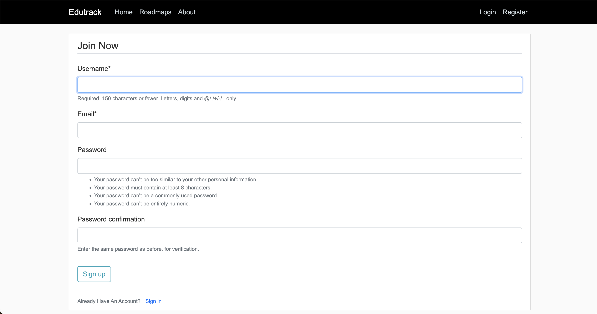
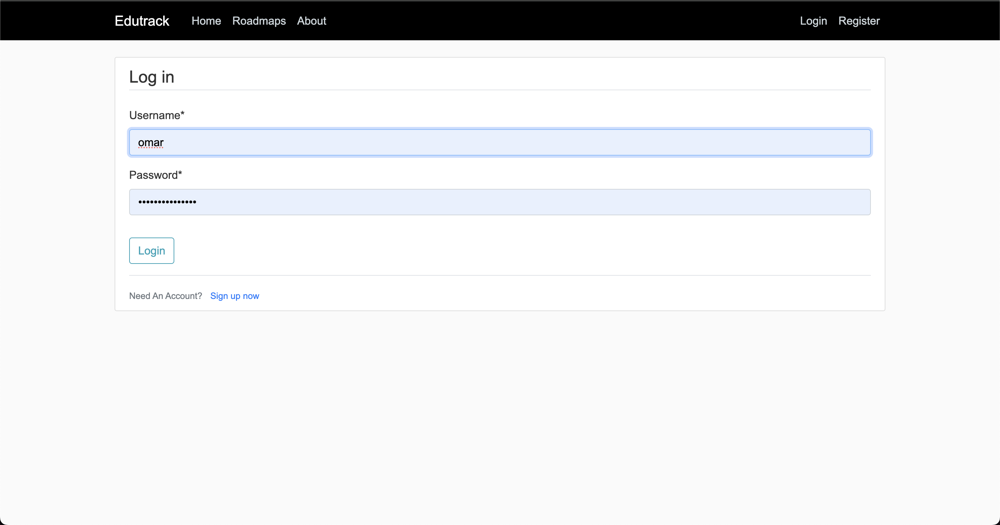

# Student Productivity Platform

Welcome to the **Student Productivity Platform**, a full-stack web application built to enhance student productivity and help them manage their study time effectively. This platform allows students to connect with others, share productivity tips, and track their own progress.

<div style="display: flex; justify-content: center; align-items: center; flex-wrap: wrap;">
  
  
  
  
  
  
  
</div>

##  

## Features

### User Authentication
- **Register**: New users can create an account.

- **Login**: Registered users can log into the platform.

- **Profile Management**: Users can edit their profile, add a profile picture, and manage their account details.


### Posts Management
- **Add Posts**: Users can share posts related to productivity and study techniques.

- **Post Details, Edit and Delete Posts**: Users can modify or delete their posts as needed.

- **Profile View**: Each user's profile displays their personal posts.


### Productivity Tools
- **Roadmaps**: Access detailed study roadmaps through the navigation bar.


- **Study Timer**: Use the built-in study timer to track study sessions and improve time management.


## Technologies Used

### Frontend:
- **HTML**
- **CSS**
- **JavaScript**
- **Bootstrap**: For responsive design and layout.

### Backend:
- **Django**: A powerful Python web framework for building the backend functionality.

## Project Aim

The main goal of this website is to improve student productivity by providing a platform where users can:
- Share and access study tips and productivity posts.
- Track their study sessions and performance over time.
- Get insights into their study habits and improve them.

## Steps of the Project

This section outlines the steps taken to develop the Student Productivity Platform, from project creation to deployment.

1. **Create a Django Project**:
   Start by creating a new Django project using the following command:
   ```bash
   django-admin startproject myproject
Create Django Apps: To manage different functionalities, create separate Django apps:

- Main App (for posts management):
```python manage.py startapp main```
- Timer App (for tracking study sessions):
```python manage.py startapp timer```
- Users App (for user profile management):
```python manage.py startapp users```
- Define Models and Run Migrations: In each app's models.py, define your data models. After defining the models, create and apply migrations to set up the database:

```python manage.py makemigrations
python manage.py migrate
```
## Modify Views and URLs:

- Update the views.py in each app to handle application logic and render templates.
- Define URL patterns in urls.py to connect views to the appropriate routes.
- Update Main Project Settings: Open settings.py in the project directory and add the newly created apps to the INSTALLED_APPS list:
```
INSTALLED_APPS = [
    ...
    'main',
    'timer',
    'users',
]
```
- Create Template Files: Create a directory named templates in each app and add HTML files for rendering views. Ensure each template is structured to allow for easy reuse.

- Set Up Static Files:

- Create a directory for static files:
``` mkdir -p static/main/css ```
- Add a main.css file in static/main/css for styling, utilizing Bootstrap for responsive design.
- Configure Media Files: Set up a media directory to store user-uploaded images and default profile pictures:

- Create a Dockerfile: Develop a Dockerfile to containerize your application for development and deployment:

- Set Up CI/CD with Jenkins and ArgoCD:

- Create a Jenkinsfile for Continuous Integration to automate testing and builds.
- Integrate ArgoCD for Continuous Deployment, allowing for easy deployment of changes to the application.
Run the Application:

- Build and run the Docker container to test the application locally:

- docker build -t student-productivity-platform .
- docker run -p 8001:8000 student-productivity-platform
- Access the Application: Open your web browser and navigate to http://localhost:8001/ to view the running application.

- Run Tests: After making changes, run tests to ensure everything is functioning correctly:


```python manage.py test```
- Deploy to Production: Once tested, deploy the application using your CI/CD pipeline for production use.

- This structured approach will help ensure a smooth development process and facilitate collaboration among team members.
